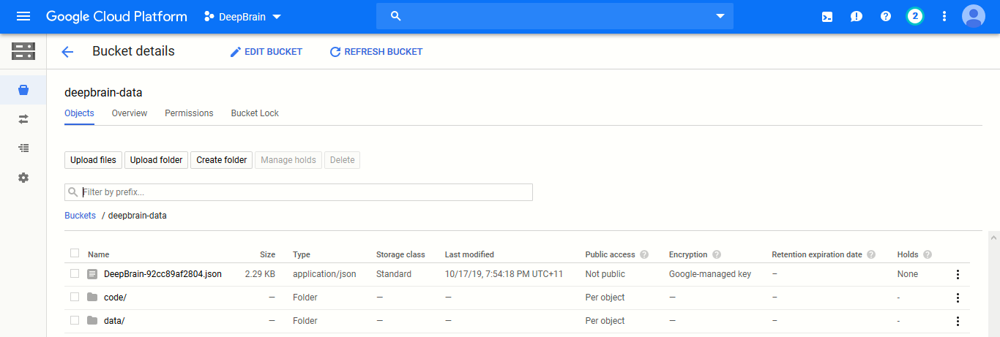
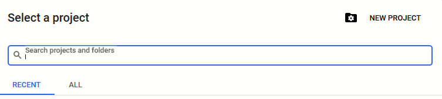
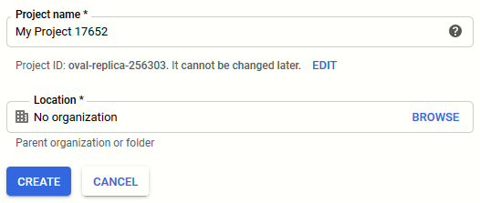
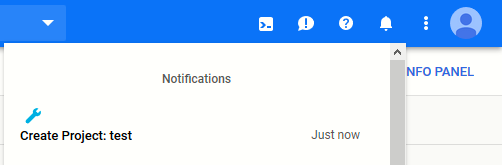
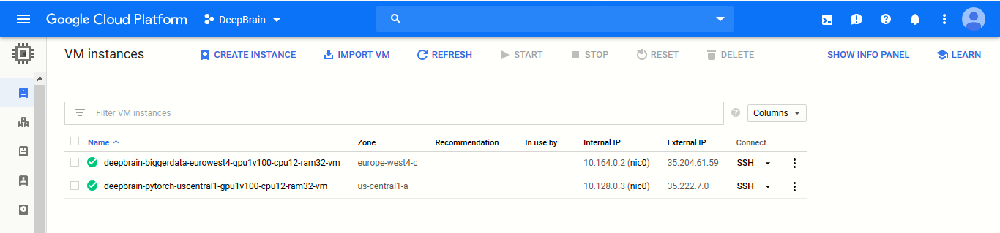
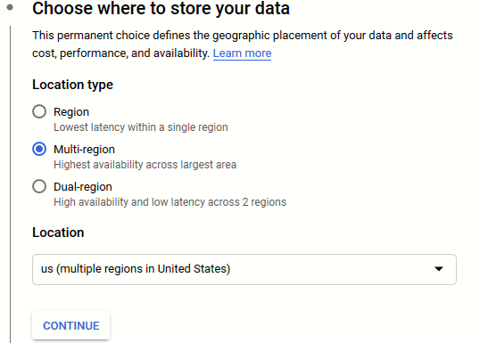
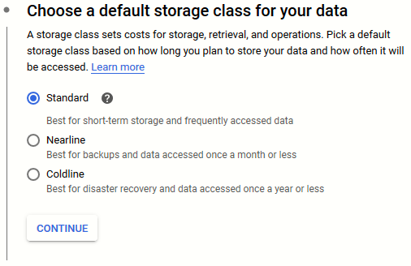
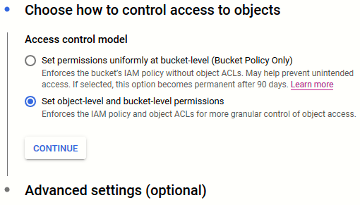

# GCP - Creating Computing Resources
Documentation and resources for creating the necessary computing resources needed to run Deep learning models on Google Cloud Platform (GCP). 

* [Key Background Information](#key-background-information)
* [Creating a GCP Project](#creating-a-gcp-project)
* [Creating a Virtual Machine (VM) instance](#creating-a-virtual-machine-vm-instance)
* [Creating GCP Storage Buckets](#creating-gcp-storage-buckets)

 

---

### Key Background Information
GCP allows users to utilise their high-performance machines to run, train and deploy (for production) data-heavy models, whether they are a Machine learning, a Deep learning or a computationally expensive system. Such resources include:
  - **CPUs**
  - **GPUs**
  - **TPUs**

In addition to computing power, GCP offers storage capacities to cater for different forms and sizes of data. Tools that are applicable to us are:  
  - **Google Storage**: a "Google Drive" clone used to store data on a file-directory system organised in a hierarchy. This is accessed via a User-interface that allows for basic file and folder uploads from local machines to the cloud service.   
  
    
  An advantage to using GCP's storage facilities, is the smooth integration of GCP's services. For example, when opting to store training data for a deep learning model on GCP Storage, multiple computing resources on GCP can connect to it via the g-suite API service which allows for importing and exporting to/from these resources data efficiently (as opposed to using local machines with slow I/O operations, building custom scripts or using additional 3rd part applications to transfer and connect data to VM instances over the net). Generally, <b>Storing large data, that needs to be utilised by GPC services, on GCP Storage is <i>recommended</i>...</b>
---

### Creating a GCP Project
Assuming a GCP account has been activated, the first step is to create a GCP project. This is to allow a user to utilise the services GCP provides. Normally, this is created on an individual <i>project</i> basis, as GCP projects are distinct in their resources. This means that all the services created within a GCP project are unique to it and cannot be easily accessed by other GCP projects.  
<b>NOTE:</b> There is a quota for how many GCP projects can be created on an account (Maximum of 22). Be careful to not exhaust this resource. Contacting Google to increase this quota is possible, if need be...  
So, to create a project:
  1. Click on the currently-selected project name in the top-left corner of the console dashboard ("DeepBrain" in the example below).
    
  
    
  1. After a Popup appears, click on the "New Project" button in the top right corner of the popup.
    
  
    
  1. Provide the GCP project with a meaningful name. There is also an option to edit the Project ID which is used as a reference for the project throughout GCP (this cannot be changed later, so make sure that you initially are happy with it so you don't need to change it later on). Organisation can be left as "No Organisation". Click "Create".
    
  
    
  1. You will be directed to the "Resource Management" page, in which all the projects that have been created will be visible. Wait for the new project to be configured by GCP and it should appear shortly in the list.   
  <b>Quick tip:</b> There is a "Notification" bar at the top right corner of the screen (the bell icon). It shows updates about newly-created, modified and/or deleted resources in GCP. Observe this bar to confirm that the project has indeed been created successfully ...  
    
  
    
---

### Creating a Virtual Machine (VM) instance

Now that we have a GCP project set-up, we can start allocating computing resources to it. These are basically machines that can be created "on-the-fly" which can be utilised for our intended uses.  
Primarily, this resource will be our preferable choice to run deep learning projects on as they are <b>easy</b> to create/maintain/access/modify/delete, relatively <b>cheap</b> to run in comparison to other GCP services. Creating one is an easy process:  
  * Using the left-hand navigation menu, select <b>"Compute Engine"</b> -> <b>"VM Instances"</b> 
      
    
      
  * A pop-up will appear if this is the first time you are creating a VM instance, a <b>"Create"</b> button will appear for this, click on it. Otherwise, the button will be located on the top bar of the "VM Instances" page. 
  * The creation page offers a range of methods to instantiate our VM instance: 
    1. We can customly create one which is the default choice. The instance's specifications are configured by us (hardware, OS, security, etc...). 
    1. We can also create an instance from a previously created template for VM instances. This is useful for instances that will be commonly created and re-created over time. We'll talk about templates later on...
    1. Finally, we can also deploy an instance that is available from the "GCP MarketPlace". Many of these are pre-configured according to its intended use. For example, ready-to-go solutions relevant to us include the "Deep Learning VM" which comes pre-configured with certain learning frameworks we intend to use for deep learning projects as well as appropriate hardware specifications needed to carry out such tasks.
      
    
      
      <b>NOTE:</b> It is worth noting for these 3 approaches the name of the VM and the region in which it will be setup. Make sure the name is informative as there is no description associated with these instances (eg. deepBrain-uswest1-cpu12-gpu1-ram32). As for the region, make sure that the choice is suitable for the project that will run on this instance. Issues like consistent data transfer and efficiency need to be considered for this option.  
  * Once you are happy with the configuration, click on the <b>"Create"</b> button.
  * It could take the instance a couple of minutes for it to be operable. You can examine its progress in the notification bar at the top or on the "VM Instances page". Once it is ready, a green tick will appear next to the instance's name on the page, as shown in the image below:
    
  
    

  Now you are ready to use the VM instance!
### Creating GCP Storage Buckets
As mentioned before, GCP offers a storage service that can be integrated easily with other GCP services. This is done by using what is called "Buckets", a term used to identity a set of data that has certain access permissions and to segregate between different sets of data. In our case, it will be used to split the data based on different factors (eg size, different forms of the dataset, etc.).  
  * In the left Navigation menu, scroll down to <b>"Storage"</b> -> <b>"Browser"</b>.
  * Click on <b>"Create Bucket"</b>.
    
  
    
  * Enter information according to the project for which the bucket will be used. Again there are certain points to consider for buckets:  
    1. The <b>"Location Type"</b> should be kept to the "Region (Lowest Latency within a single region)". This will ensure that when accessing the data later on using VMs or other services, we do not encounter latency issues that can have been easily avoided. Only if multiple computing resources we create are located in different regions within a zone, then maybe consider using multi or dual region storages.
    
  
    
    1. The <b>"Storage Class"</b> option determines how GCP will charge you for this data. If the data that is going to be stored on this bucket is accessed frequently and will not remain on the bucket for a long time, then consider selecting "Standard". However, if the data will be stored on the bucket for a while and will be accessed rarely (1-2 times/year), then consider choosing "Coldline". The intermediate option "Nearline" is for data that will be accessed occasionally and stored for a medium time-range. For more details as to how the billing for this data works, follow this [link](https://cloud.google.com/storage/docs/storage-classes).
    
  
    
    1. As for the <b>"Control Access Model"</b>, this is not too much of a concern to us, so we set it to "Set object-level and bucket-level permissions". We only want to have admin user accounts accessing these resources. If there is a need to have multiple user accounts accessing this information, then the documentation will be updated accordingly.
    
  
    
  * Once the configuration is complete, click on <b>"Create"</b>.
  * It could take the bucket a couple of minutes for it to be operable. Once it is ready, it will appear in the "GCP Storage" browser.